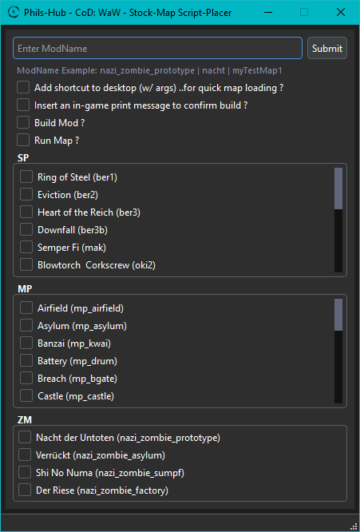

# cod_waw.stock_map.script_placer
Creates a mod with the relevant decompiled stock map files.

## Installation

Place the executable in your call of duty: world at war Steam folder.

If you're using a non-steam version, then let me know and ill add an option to the GUI to toggle steam/non-steam.

Place the 'Stock Map Files' folder on your desktop, you'll need to move them during the below 'Usage' step.

## Usage

Run exe, input a mod name, select a map, click submit.

If first time creating a mod:
  
- It will inform you that a directory does not exist, this is normal.
- Navigate to the `waw_root/Phils-Hub/Stock-Map Script-Placer` directory and place the `Stock Map Files` folder into it.
- All modes (sp, mp, zm) go into the `waw_root/Phils-Hub/Stock-Map Script-Placer/Stock Base Files` directory.
- The tool will not break when the `Stock Map Files` folder isn't present, you can also utilize the tool for a specific mode if you don't mod all modes. Meaning you can safely only have an 'sp' folder in the `Stock Map Files` folder for example. It just means that you will see that error pop-up message if you try to create a mod for a mode of which the base files aren't present.

Now you can click submit again and it will create the mod.

## Note

The following maps only have a few files (all .gsc from raw) available, due to the FF extractor failing to do its job.
- sp_pel1a (Burn 'Em Out)
- mp_shrine (Cliffside)

## Addtional Notes

ff extractor (for extracting the stock base files yourself)
source
https://tom-crowley.co.uk/downloads

if source ever becomes unavailable
https://1drv.ms/u/s!AjIuIzvxDorcr_I7FDZ74xE23kg7Qw?e=gEuVvu

how-to download/run/setup/use exe
https://youtu.be/X29Nrvj9YOE

how-to build/run mod
https://youtu.be/xJZ4co0FpF4

## License

MIT License

## Contributing

This project is open source and free to use, modify, and distribute under the terms of the [MIT License]

## Acknowledgements

This is a Phils-Hub community-contributed project.

## Screen Shots ##

